# 🏆 Artificial Intelligence & Data Science Badges Portfolio

<div align="center">


**Showcasing Professional Growth Through Industry-Recognized Digital Badges**

[](https://www.youracclaim.com/earner/earned)
[](https://open.sap.com/dashboard/documents)

</div>

---

## 📖 Overview

This repository serves as a comprehensive showcase of my professional development journey in **Artificial Intelligence**, **Data Science**, and **Enterprise Technology**. Each digital badge represents completed coursework, hands-on projects, and demonstrated competency in cutting-edge technologies.

> *Digital badges are online, shareable, industry-wide recognizable forms of achievement that validate skills and knowledge in specific technology domains.*

---

## 🎯 Technical Competencies

<div align="center">

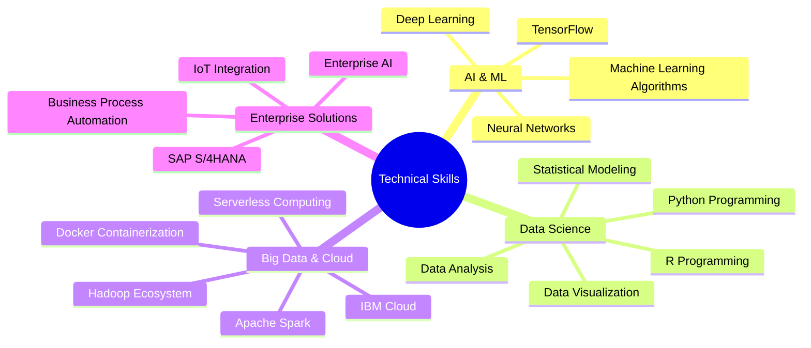

</div>

---

## 🏅 IBM Developer Skills Network Certifications

<div align="center">

### 🔄 **Badge Carousel** 
*Hover over badges to see details*

<table>
<tr>
<td align="center" width="20%">

<br><sub><b>Applied Data Science<br>with Python</b></sub>
</td>
<td align="center" width="20%">
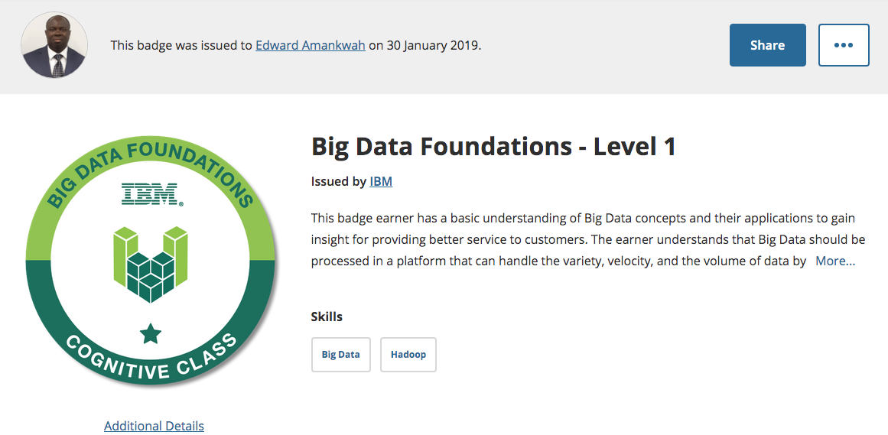
<br><sub><b>Big Data<br>Foundations</b></sub>
</td>
<td align="center" width="20%">
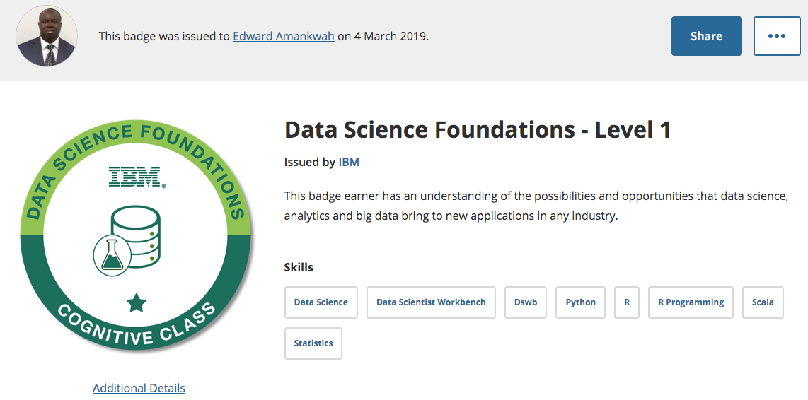
<br><sub><b>Data Science<br>Foundations</b></sub>
</td>
<td align="center" width="20%">
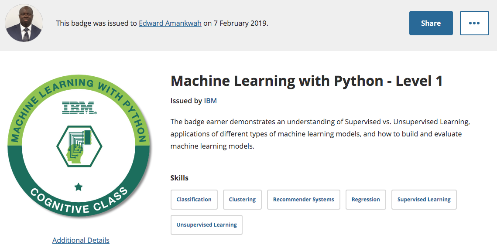
<br><sub><b>Machine Learning<br>with Python</b></sub>
</td>
<td align="center" width="20%">
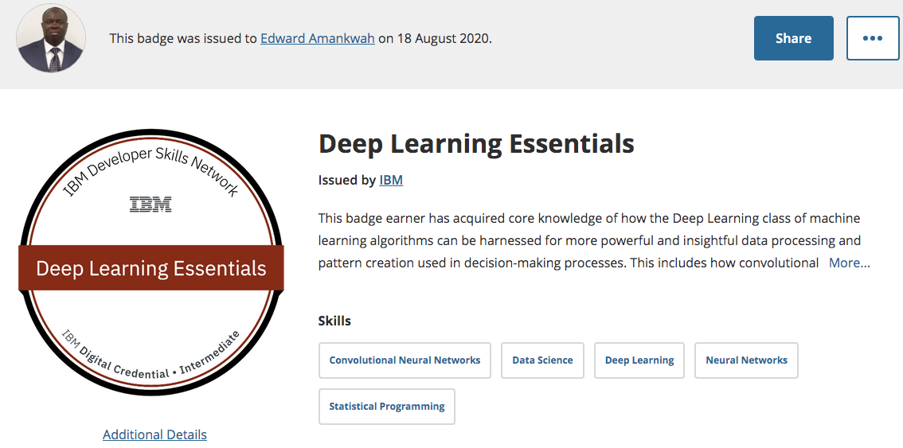
<br><sub><b>Deep Learning<br>Essentials</b></sub>
</td>
</tr>
<tr>
<td align="center" width="20%">

<br><sub><b>Data Analysis<br>Using Python</b></sub>
</td>
<td align="center" width="20%">

<br><sub><b>Data Visualization<br>Using Python</b></sub>
</td>
<td align="center" width="20%">
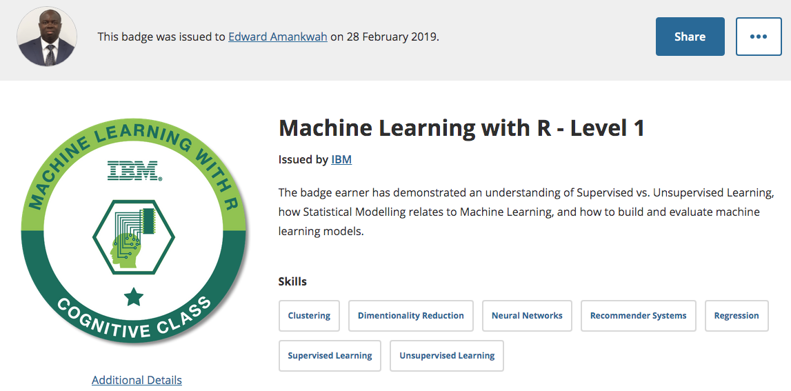
<br><sub><b>Machine Learning<br>with R</b></sub>
</td>
<td align="center" width="20%">
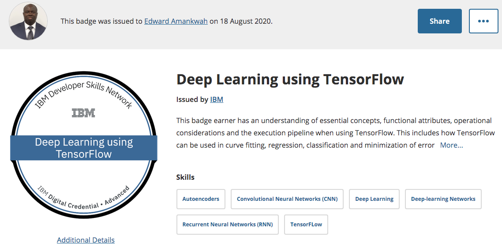
<br><sub><b>Deep Learning<br>using TensorFlow</b></sub>
</td>
<td align="center" width="20%">

<br><sub><b>Python for<br>Data Science</b></sub>
</td>
</tr>
<tr>
<td align="center" width="20%">
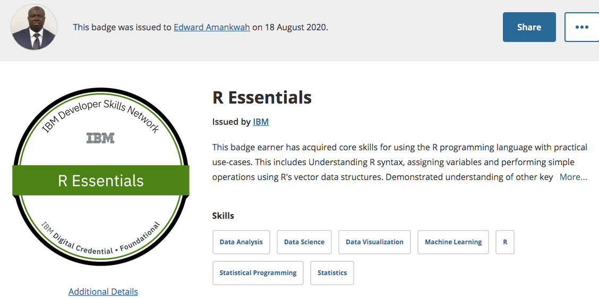
<br><sub><b>R Programming<br>Essentials</b></sub>
</td>
<td align="center" width="20%">
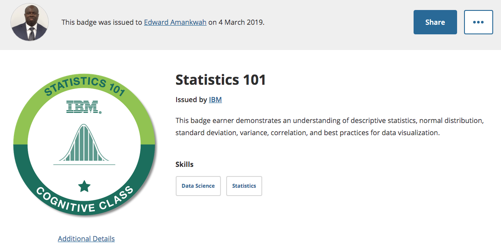
<br><sub><b>Statistics<br>Fundamentals</b></sub>
</td>
<td align="center" width="20%">
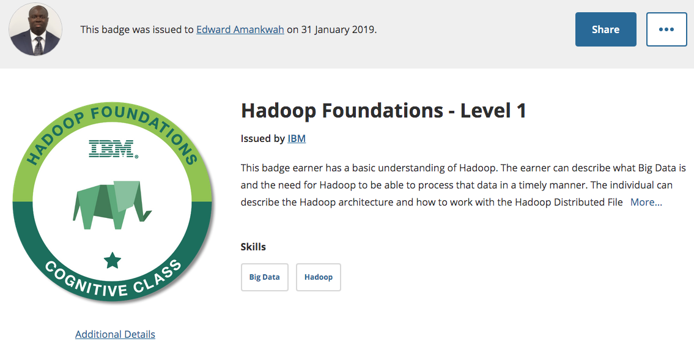
<br><sub><b>Hadoop<br>Foundations</b></sub>
</td>
<td align="center" width="20%">
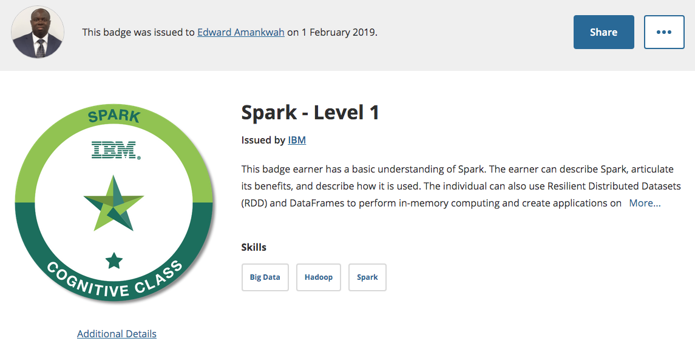
<br><sub><b>Apache Spark<br>Level 1</b></sub>
</td>
<td align="center" width="20%">
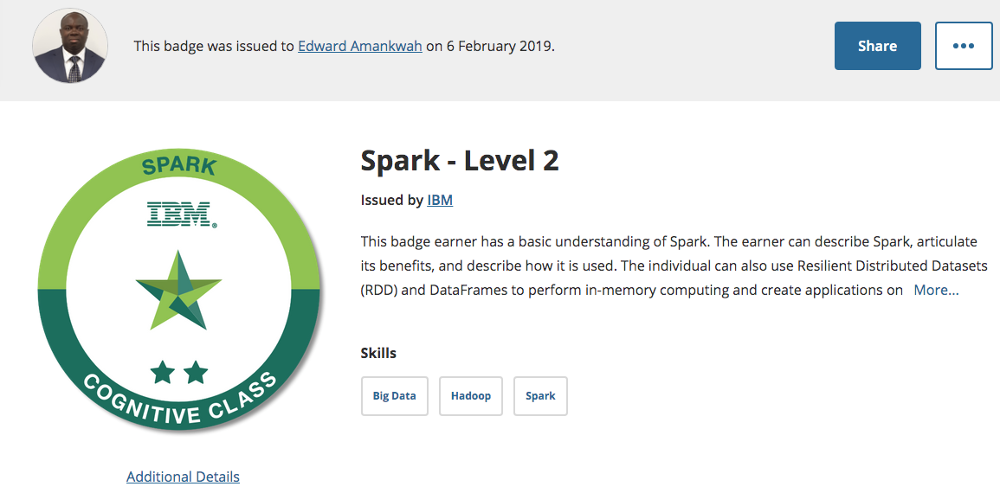
<br><sub><b>Apache Spark<br>Level 2</b></sub>
</td>
</tr>
<tr>
<td align="center" width="20%">
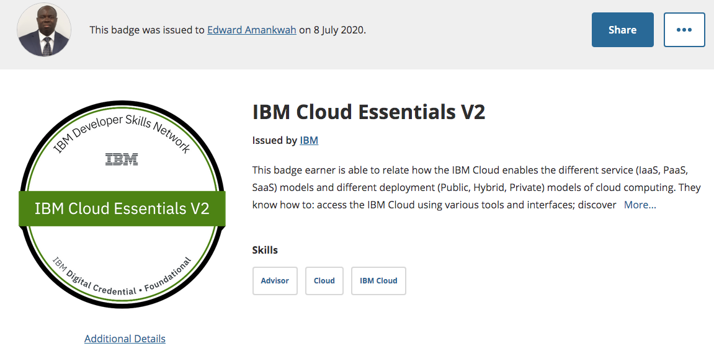
<br><sub><b>IBM Cloud<br>Essentials</b></sub>
</td>
<td align="center" width="20%">
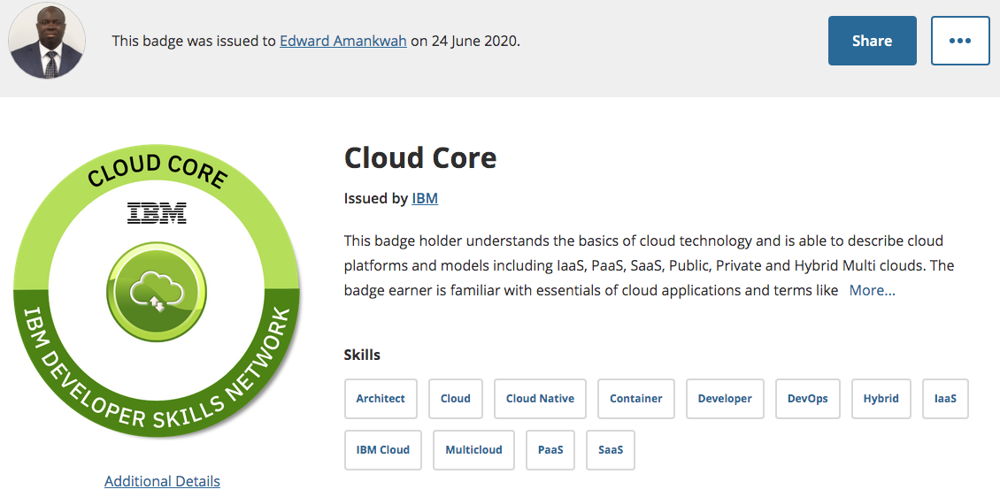
<br><sub><b>Cloud Computing<br>Core</b></sub>
</td>
<td align="center" width="20%">
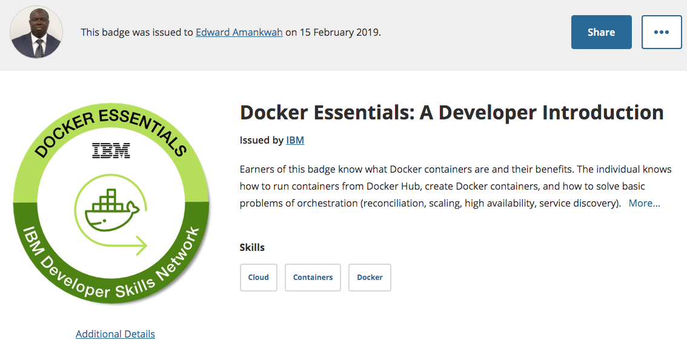
<br><sub><b>Docker<br>Essentials</b></sub>
</td>
<td align="center" width="20%">

<br><sub><b>Serverless<br>Computing</b></sub>
</td>
<td align="center" width="20%">
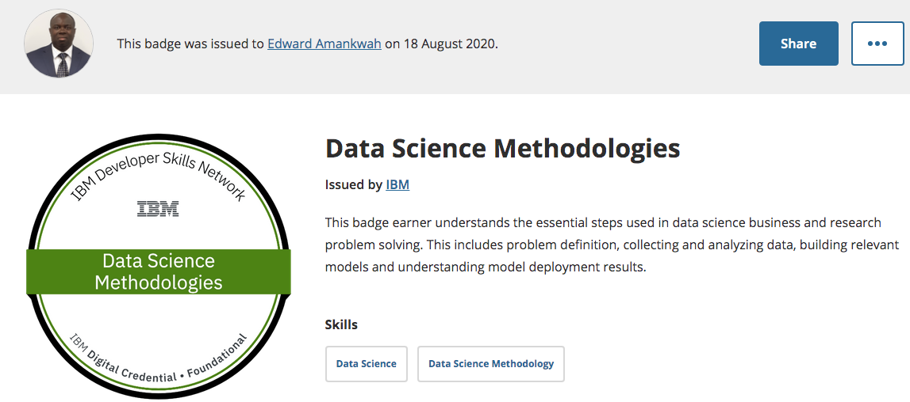
<br><sub><b>Data Science<br>Methodologies</b></sub>
</td>
</tr>
</table>

</div>

### 📊 **Certification Statistics**

```
🎓 Total IBM Badges: 19+
📈 Skill Areas: 8 Major Domains
⏱️ Learning Hours: 200+ Hours
🔄 Completion Rate: 100%
```

---

## 🌟 SAP openSAP Enterprise Certifications

<div align="center">

### 🏢 **Enterprise Technology Expertise**

<table>
<tr>
<td align="center" width="25%">

<br><sub><b>SAP S/4HANA Cloud Implementation</b></sub>
<br><a href="https://open.sap.com/verify/xuros-lamon-tyfem-hitod-zider">🔗 Verify Certificate</a>
</td>
<td align="center" width="25%">
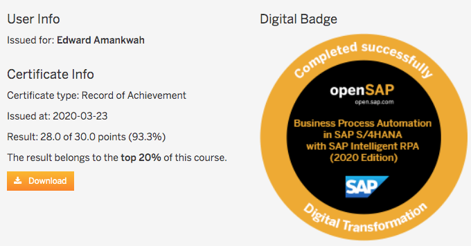
<br><sub><b>Business Process Automation with SAP RPA</b></sub>
<br><a href="https://open.sap.com/verify/xeved-gygup-gibyr-nosun-corep">🔗 Verify Certificate</a>
</td>
<td align="center" width="25%">
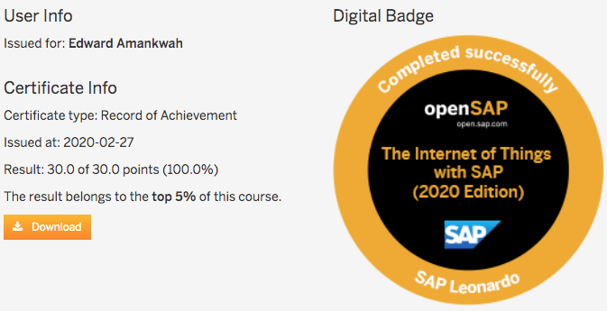
<br><sub><b>Internet of Things with SAP</b></sub>
<br><a href="https://open.sap.com/verify/xezec-gopoh-rovad-vused-sykyh">🔗 Verify Certificate</a>
</td>
<td align="center" width="25%">

<br><sub><b>SAP Data Intelligence for Enterprise AI</b></sub>
<br><a href="https://open.sap.com/verify/xetil-tagat-nyhad-cumed-bubis">🔗 Verify Certificate</a>
</td>
</tr>
</table>

### 📈 **Analytics Certification**
<div align="center">

<br><b>Analytics with SAP Cloud Platform</b>
<br><a href="https://open.sap.com/dashboard/documents">📊 View Dashboard</a>
</div>

</div>

---

## 🛠️ **Technology Stack & Skills Matrix**

<div align="center">

| **Category** | **Technologies** | **Proficiency** |
|:---|:---|:---:|
| **Programming Languages** | Python, R, SQL |  |
| **Machine Learning** | Scikit-learn, TensorFlow, Keras |  |
| **Data Processing** | Pandas, NumPy, Apache Spark |  |
| **Visualization** | Matplotlib, Seaborn, Plotly |  |
| **Big Data** | Hadoop, Spark, Hive |  |
| **Cloud Platforms** | IBM Cloud, SAP Cloud Platform |  |
| **Enterprise Solutions** | SAP S/4HANA, SAP RPA, IoT |  |
| **DevOps** | Docker, Serverless Computing |  |

</div>

---

## 🎨 **Interactive Badge Gallery**

<details>
<summary>🔍 <b>Click to Explore Badge Categories</b></summary>

### 🤖 **Artificial Intelligence & Machine Learning**
* Deep Learning Essentials
* Deep Learning using TensorFlow
* Machine Learning with Python (Level 1)
* Machine Learning with R (Level 1)
* SAP Data Intelligence for Enterprise AI

### 📊 **Data Science & Analytics**
* Applied Data Science with Python (Level 2)
* Data Science Foundations (Level 1)
* Data Analysis Using Python (Level 1)
* Data Visualization Using Python (Level 1)
* Python for Data Science
* R Essentials
* Statistics 101
* Analytics with SAP Cloud Platform

### 🏗️ **Big Data & Infrastructure**
* Big Data Foundations (Level 1)
* Hadoop Foundations (Level 1)
* Apache Spark (Level 1 & 2)
* IBM Cloud Essentials V2
* Cloud Core
* Docker Essentials
* Serverless Computing using Apache OpenWhisk

### 🏢 **Enterprise & Business Solutions**
* SAP S/4HANA Cloud Implementation
* Business Process Automation with SAP RPA
* Internet of Things with SAP
* Data Science Methodologies

</details>

---

## 📈 **Learning Journey Timeline**

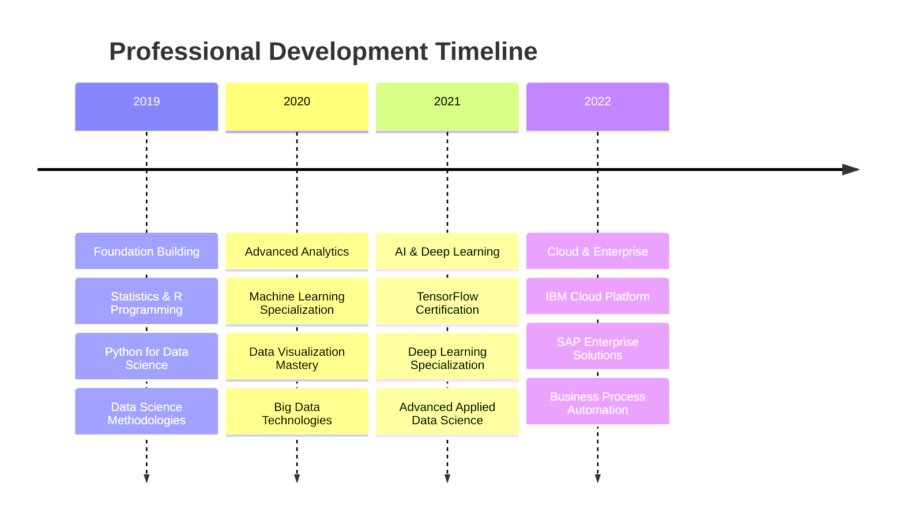

---

## 🔗 **Verification & Links**

### 📋 **Official Badge Verification**
- **IBM Badges**: [View All IBM Certifications](https://www.youracclaim.com/earner/earned)
- **SAP openSAP**: [Access Learning Dashboard](https://open.sap.com/dashboard/documents)

### 🎯 **Individual Certificate Verification**
| **Certification** | **Verification Link** | **Issue Date** |
|:---|:---|:---:|
| SAP S/4HANA Cloud Implementation | [Verify](https://open.sap.com/verify/xuros-lamon-tyfem-hitod-zider) | 2019 |
| SAP Intelligent RPA | [Verify](https://open.sap.com/verify/xeved-gygup-gibyr-nosun-corep) | 2019 |
| IoT with SAP | [Verify](https://open.sap.com/verify/xezec-gopoh-rovad-vused-sykyh) | 2019 |
| SAP Data Intelligence | [Verify](https://open.sap.com/verify/xetil-tagat-nyhad-cumed-bubis) | 2019 |

---

## 🚀 **What's Next?**

<div align="center">

```
🎯 Currently Pursuing:
   ├── Advanced AI Specializations
   ├── Cloud Architecture Certifications
   ├── MLOps and Model Deployment
   └── Enterprise AI Strategy

📅 2025 Goals:
   ├── AWS/Azure AI Certifications
   ├── Kubernetes & Container Orchestration  
   ├── Real-time Analytics & Streaming
   └── Edge AI & IoT Integration
```

</div>

---

## 📞 **Connect & Collaborate**

<div align="center">

[](https://linkedin.com/in/edwardamankwah)
[](https://github.com/eaamankwah)
[](https://yourportfolio.com)

**Let's build the future with AI and Data Science! 🤝**

</div>

---

<div align="center">

*This repository is a living document of my professional growth and commitment to staying at the forefront of AI and data science technologies.*


</div>

---

## 📄 **License**

This repository is licensed under the MIT License - see the [LICENSE.md](https://creativecommons.org/licenses/by/4.0/) file for details.

**© 2025 | Professional AI & Data Science Portfolio**
