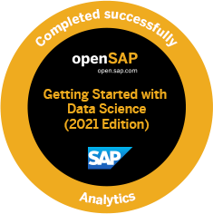
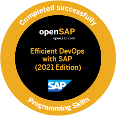
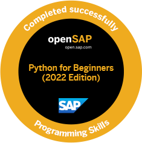
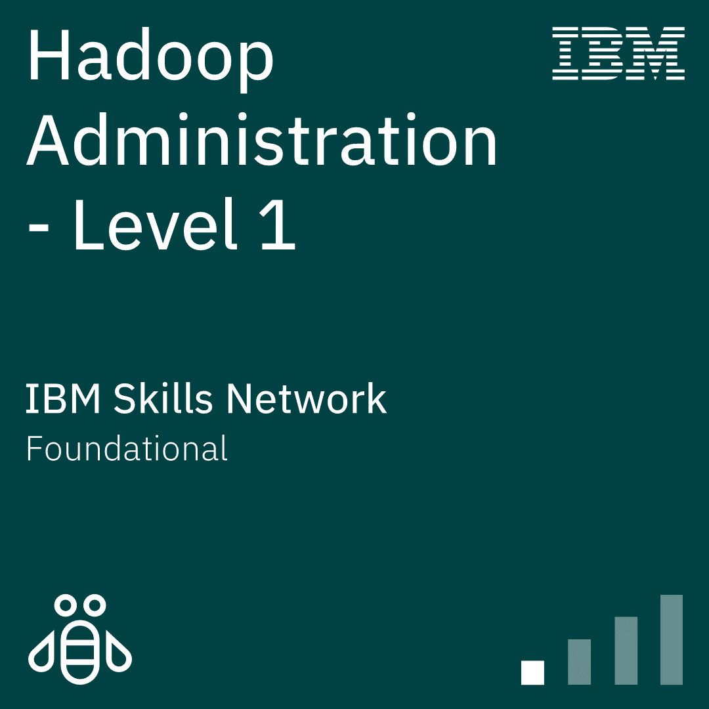
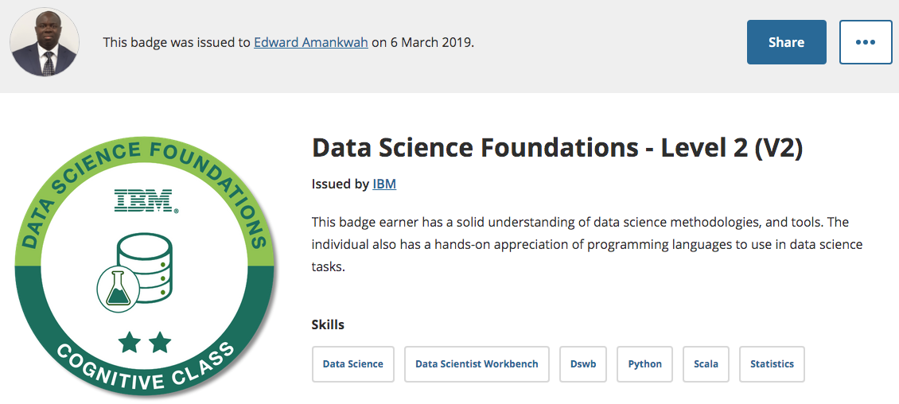

# 🏆 Artificial Intelligence & Data Science Badges Portfolio

<div align="center">


**Showcasing Professional Growth Through Industry-Recognized Digital Badges**

[](https://www.youracclaim.com/earner/earned)
[](https://open.sap.com/dashboard/documents)

</div>

## 🌐 **Multi-Platform Certifications Portfolio**

<div align="center">

[](https://www.youracclaim.com/earner/earned)
[](https://open.sap.com/dashboard/documents)
[](#google-certifications)
[](#microsoft-certifications)
[](#aws-certifications)
[](#comptia-certifications)

</div>

---

## 🌟 **Google Cloud & Analytics Certifications**

<div align="center" id="google-certifications">

### 📊 **Google Professional Certificates**

<table>
<tr>
<td align="center" width="25%">

<br><sub><b>Google Advanced<br>Data Analytics</b></sub>
</td>
<td align="center" width="25%">

<br><sub><b>Google Advanced<br>Analytics 2022</b></sub>
</td>
<td align="center" width="25%">

<br><sub><b>Google Business<br>Intelligence</b></sub>
</td>
<td align="center" width="25%">

<br><sub><b>Google IT Support<br>Professional</b></sub>
</td>
</tr>
<tr>
<td align="center" colspan="2">

<br><sub><b>Google IT Automation<br>with Python</b></sub>
</td>
<td align="center" colspan="2">

<br><sub><b>Google Cloud<br>Digital Leader</b></sub>
</td>
</tr>
</table>

</div>

---

## 🔷 **Microsoft Azure Certifications**

<div align="center" id="microsoft-certifications">

<table>
<tr>
<td align="center" width="25%">

<br><sub><b>Microsoft Azure<br>Fundamentals (AZ-900)</b></sub>
</td>
<td align="center" width="25%">

<br><sub><b>Azure Fundamentals<br>Certification Badge</b></sub>
</td>
<td align="center" width="25%">

<br><sub><b>Microsoft Machine<br>Learning Engineer</b></sub>
</td>
<td align="center" width="25%">

<br><sub><b>Microsoft Nanodegree<br>Recipient</b></sub>
</td>
</tr>
</table>

</div>

---

## 🟠 **AWS AI & Machine Learning Certifications**

<div align="center" id="aws-certifications">

<table>
<tr>
<td align="center" width="33%">

<br><sub><b>AWS AI & ML<br>Scholars 2025</b></sub>
</td>
<td align="center" width="33%">

<br><sub><b>AWS Educate ML<br>Foundations</b></sub>
</td>
<td align="center" width="33%">

<br><sub><b>AWS Cloud<br>Essentials</b></sub>
</td>
</tr>
</table>

</div>

---

## 🔴 **CompTIA Professional Certifications**

<div align="center" id="comptia-certifications">

<table>
<tr>
<td align="center" width="50%">

<br><sub><b>CompTIA Data+<br>Continuing Education</b></sub>
</td>
<td align="center" width="50%">

<br><sub><b>CompTIA<br>DataX</b></sub>
</td>
</tr>
</table>

</div>

---

## 🎓 **Scholarship & Fellowship Programs**

<div align="center">

### 🏆 **Academic Excellence Recognition**

<table>
<tr>
<td align="center" width="20%">

<br><sub><b>BIT<br>Scholarship</b></sub>
</td>
<td align="center" width="20%">

<br><sub><b>BIT Scholarship<br>Phase 2 (2021)</b></sub>
</td>
<td align="center" width="20%">

<br><sub><b>BIT Scholarship<br>Finalist 2021</b></sub>
</td>
<td align="center" width="20%">

<br><sub><b>Bertelsmann<br>Challenge Finalist</b></sub>
</td>
<td align="center" width="20%">

<br><sub><b>Bertelsmann<br>Year 3 Scholarship</b></sub>
</td>
</tr>
<tr>
<td align="center" width="20%">

<br><sub><b>SUSE<br>Scholarship 2021</b></sub>
</td>
<td align="center" width="20%">

<br><sub><b>PyTorch<br>Acceptance 2019</b></sub>
</td>
<td align="center" width="20%">

<br><sub><b>NextGen<br>Challenge 2023</b></sub>
</td>
<td align="center" width="20%">

<br><sub><b>Frontend Developer<br>Phase 1 (2023)</b></sub>
</td>
<td align="center" width="20%">

<br><sub><b>GCC Python<br>Badge</b></sub>
</td>
</tr>
</table>

</div>

---

## 🧠 **Extended SAP & Advanced Analytics**

<div align="center">

### 🔬 **Advanced SAP Technologies**

<table>
<tr>
<td align="center" width="20%">

<br><sub><b>SAP Data<br>Science</b></sub>
</td>
<td align="center" width="20%">

<br><sub><b>SAP Design<br>Thinking</b></sub>
</td>
<td align="center" width="20%">

<br><sub><b>SAP Analytics<br>Cloud 2022</b></sub>
</td>
<td align="center" width="20%">

<br><sub><b>AI Ethics<br>SAP 2024</b></sub>
</td>
<td align="center" width="20%">

<br><sub><b>SAP DevOps<br>2021</b></sub>
</td>
</tr>
<tr>
<td align="center" width="20%">

<br><sub><b>SAP Visual<br>Sketch-it 2021</b></sub>
</td>
<td align="center" width="20%">

<br><sub><b>SAP HANA Cloud<br>Database</b></sub>
</td>
<td align="center" width="20%">

<br><sub><b>Generative AI<br>Fundamentals</b></sub>
</td>
<td align="center" width="20%">

<br><sub><b>Python<br>Programming 2022</b></sub>
</td>
<td align="center" width="20%">

<br><sub><b>GenAI for<br>Higher Education</b></sub>
</td>
</tr>
</table>

</div>

---

## 🏗️ **Extended Big Data & Cloud Infrastructure**

<div align="center">

<table>
<tr>
<td align="center" width="20%">

<br><sub><b>Hadoop<br>Administration L1</b></sub>
</td>
<td align="center" width="20%">

<br><sub><b>Hadoop<br>Data Access L1</b></sub>
</td>
<td align="center" width="20%">

<br><sub><b>Hadoop<br>Foundations L2</b></sub>
</td>
<td align="center" width="20%">

<br><sub><b>Hadoop<br>Programming L1</b></sub>
</td>
<td align="center" width="20%">

<br><sub><b>Databricks<br>Lakehouse</b></sub>
</td>
</tr>
<tr>
<td align="center" width="20%">

<br><sub><b>IBM Serverless<br>Computing</b></sub>
</td>
<td align="center" width="20%">

<br><sub><b>Serverless<br>Cloud Functions</b></sub>
</td>
<td align="center" width="20%">

<br><sub><b>Enterprise<br>Data Analytics</b></sub>
</td>
<td align="center" width="20%">

<br><sub><b>Data Certified<br>Professional</b></sub>
</td>
<td align="center" width="20%">

<br><sub><b>Pearson EdTech<br>Symposium 2024</b></sub>
</td>
</tr>
</table>

</div>

---

## 📋 **Project Management & Agile Certifications**

<div align="center">

<table>
<tr>
<td align="center" width="50%">

<br><sub><b>Fundamentals of<br>Agile Project Management</b></sub>
</td>
<td align="center" width="50%">

<br><sub><b>Fundamentals of<br>Predictive Project Management</b></sub>
</td>
</tr>
</table>

</div>

---

## 📖 Overview

This repository serves as a comprehensive showcase of my professional development journey in **Artificial Intelligence**, **Data Science**, and **Enterprise Technology**. Each digital badge represents completed coursework, hands-on projects, and demonstrated competency in cutting-edge technologies.

> *Digital badges are online, shareable, industry-wide recognizable forms of achievement that validate skills and knowledge in specific technology domains.*

---

## 🎯 Technical Competencies

<div align="center">


</div>

---

## 🏅 IBM Developer Skills Network Certifications

<div align="center">

### 🔄 **Badge Carousel** 
*Hover over badges to see details*

<table>
<tr>
<td align="center" width="12.5%">

<br><sub><b>Applied Data Science<br>with Python L2</b></sub>
</td>
<td align="center" width="12.5%">

<br><sub><b>Applied Data Science<br>with R L2</b></sub>
</td>
<td align="center" width="12.5%">

<br><sub><b>Big Data<br>Foundations L1</b></sub>
</td>
<td align="center" width="12.5%">

<br><sub><b>Big Data<br>Foundations L2</b></sub>
</td>
<td align="center" width="12.5%">

<br><sub><b>Data Science<br>Foundations L1</b></sub>
</td>
<td align="center" width="12.5%">

<br><sub><b>Data Science<br>Foundations L2</b></sub>
</td>
<td align="center" width="12.5%">

<br><sub><b>Machine Learning<br>with Python L1</b></sub>
</td>
<td align="center" width="12.5%">

<br><sub><b>Deep Learning<br>Essentials</b></sub>
</td>
</tr>
<tr>
<td align="center" width="12.5%">

<br><sub><b>Deep Learning<br>using TensorFlow</b></sub>
</td>
<td align="center" width="12.5%">

<br><sub><b>Deep Learning<br>Advanced</b></sub>
</td>
<td align="center" width="12.5%">

<br><sub><b>Data Analysis<br>Using Python</b></sub>
</td>
<td align="center" width="12.5%">

<br><sub><b>Data Visualization<br>Using Python</b></sub>
</td>
<td align="center" width="12.5%">

<br><sub><b>Machine Learning<br>with R L1</b></sub>
</td>
<td align="center" width="12.5%">

<br><sub><b>Python for<br>Data Science</b></sub>
</td>
<td align="center" width="12.5%">

<br><sub><b>R Programming<br>Essentials</b></sub>
</td>
<td align="center" width="12.5%">

<br><sub><b>Statistics<br>Fundamentals</b></sub>
</td>
</tr>
<tr>
<td align="center" width="12.5%">

<br><sub><b>Data Science<br>for Business L1</b></sub>
</td>
<td align="center" width="12.5%">

<br><sub><b>Data Science<br>for Business L2</b></sub>
</td>
<td align="center" width="12.5%">

<br><sub><b>Hadoop<br>Foundations L1</b></sub>
</td>
<td align="center" width="12.5%">

<br><sub><b>Hadoop<br>Foundations L2</b></sub>
</td>
<td align="center" width="12.5%">

<br><sub><b>Apache Spark<br>Level 1</b></sub>
</td>
<td align="center" width="12.5%">

<br><sub><b>Apache Spark<br>Level 2</b></sub>
</td>
<td align="center" width="12.5%">

<br><sub><b>Hadoop<br>Administration L1</b></sub>
</td>
<td align="center" width="12.5%">

<br><sub><b>Hadoop<br>Programming L1</b></sub>
</td>
</tr>
<tr>
<td align="center" width="12.5%">

<br><sub><b>IBM Cloud<br>Essentials V2</b></sub>
</td>
<td align="center" width="12.5%">

<br><sub><b>Cloud Computing<br>Core</b></sub>
</td>
<td align="center" width="12.5%">

<br><sub><b>Docker<br>Essentials</b></sub>
</td>
<td align="center" width="12.5%">

<br><sub><b>Serverless<br>Computing</b></sub>
</td>
<td align="center" width="12.5%">

<br><sub><b>Data Science<br>Methodologies</b></sub>
</td>
<td align="center" width="12.5%">

<br><sub><b>Hadoop<br>Data Access L1</b></sub>
</td>
<td align="center" width="12.5%">

<br><sub><b>IBM Serverless<br>Computing</b></sub>
</td>
<td align="center" width="12.5%">

<br><sub><b>Enterprise<br>Data Analytics</b></sub>
</td>
</tr>
</table>

</div>

### 📊 **Certification Statistics**

```
🎓 Total Badges: 50+
📈 Major Platforms: IBM, SAP, Google, Microsoft, AWS, CompTIA
💼 Skill Areas: 12 Major Domains
⏱️ Learning Hours: 500+ Hours
🔄 Completion Rate: 100%
```

---

## 🌟 SAP openSAP Enterprise Certifications

<div align="center">

### 🏢 **Enterprise Technology Expertise**

<table>
<tr>
<td align="center" width="25%">

<br><sub><b>SAP S/4HANA Cloud Implementation</b></sub>
<br><a href="https://open.sap.com/verify/xuros-lamon-tyfem-hitod-zider">🔗 Verify Certificate</a>
</td>
<td align="center" width="25%">

<br><sub><b>Business Process Automation with SAP RPA</b></sub>
<br><a href="https://open.sap.com/verify/xeved-gygup-gibyr-nosun-corep">🔗 Verify Certificate</a>
</td>
<td align="center" width="25%">

<br><sub><b>Internet of Things with SAP</b></sub>
<br><a href="https://open.sap.com/verify/xezec-gopoh-rovad-vused-sykyh">🔗 Verify Certificate</a>
</td>
<td align="center" width="25%">

<br><sub><b>SAP Data Intelligence for Enterprise AI</b></sub>
<br><a href="https://open.sap.com/verify/xetil-tagat-nyhad-cumed-bubis">🔗 Verify Certificate</a>
</td>
</tr>
</table>

### 📈 **Analytics Certification**
<div align="center">

<br><b>Analytics with SAP Cloud Platform</b>
<br><a href="https://open.sap.com/dashboard/documents">📊 View Dashboard</a>
</div>

</div>

---

## 🛠️ **Comprehensive Technology Stack & Skills Matrix**

<div align="center">

| **Category** | **Technologies** | **Proficiency** | **Certifications** |
|:---|:---|:---:|:---:|
| **Programming Languages** | Python, R, SQL, JavaScript |  | 8+ |
| **Machine Learning & AI** | Scikit-learn, TensorFlow, PyTorch, Keras |  | 12+ |
| **Cloud Platforms** | AWS, Microsoft Azure, Google Cloud, IBM Cloud |  | 15+ |
| **Data Processing** | Pandas, NumPy, Apache Spark, Hadoop |  | 10+ |
| **Visualization & BI** | Matplotlib, Seaborn, Plotly, Power BI, SAP Analytics |  | 6+ |
| **Big Data Technologies** | Hadoop, Spark, Hive, Databricks |  | 8+ |
| **Enterprise Solutions** | SAP S/4HANA, SAP RPA, IoT, Business Intelligence |  | 10+ |
| **DevOps & Infrastructure** | Docker, Kubernetes, Serverless, CI/CD |  | 5+ |
| **Data Compliance & Ethics** | Data Governance, AI Ethics, Privacy Protection |  | 3+ |
| **Project Management** | Agile, Scrum, Predictive Management |  | 2+ |

</div>

---

## 🎨 **Interactive Badge Gallery**

<details>
<summary>🔍 <b>Click to Explore Badge Categories</b></summary>

### 🤖 **Artificial Intelligence & Machine Learning**
* Deep Learning Essentials & Advanced TensorFlow
* Machine Learning with Python & R (Multiple Levels)
* SAP Data Intelligence for Enterprise AI
* AWS AI & ML Scholars Program
* Microsoft Machine Learning Engineer
* PyTorch Scholarship Recipient
* Generative AI Fundamentals
* AI Ethics and Responsible AI

### 📊 **Data Science & Analytics**
* Applied Data Science with Python (Level 2)
* Google Advanced Data Analytics Professional
* Google Business Intelligence Certificate
* Data Science Foundations (Multiple Levels)
* CompTIA Data+ Certification
* SAP Analytics Cloud
* Enterprise Data Analytics
* Statistical Analysis & Methodologies

### ☁️ **Cloud & Infrastructure**
* AWS Educate ML Foundations
* Microsoft Azure Fundamentals (AZ-900)
* Google Cloud Digital Leader
* IBM Cloud Essentials & Core
* Docker & Kubernetes Essentials
* Serverless Computing (Multiple Platforms)
* Cloud Functions & Infrastructure

### 🏗️ **Big Data & Infrastructure**
* Hadoop Administration, Programming & Data Access
* Apache Spark (Level 1 & 2)
* Databricks Lakehouse Platform
* Big Data Foundations (Multiple Levels)
* Data Pipeline Architecture
* Distributed Computing Systems

### 🏢 **Enterprise & Business Solutions**
* SAP S/4HANA Cloud Implementation
* Business Process Automation with SAP RPA
* Internet of Things with SAP
* SAP Design Thinking & DevOps
* Google IT Support & Automation
* Project Management (Agile & Predictive)

### 🎓 **Academic Excellence & Scholarships**
* Multiple Scholarship Recipients (BIT, Bertelsmann, SUSE)
* Frontend Development Programs
* EdTech Symposium Participation
* Challenge Finalist Recognition

</details>

---

## 📈 **Learning Journey Timeline**


---

## 🔗 **Verification & Links**

### 📋 **Official Badge Verification**
- **IBM Badges**: [View All IBM Certifications](https://www.youracclaim.com/earner/earned)
- **SAP openSAP**: [Access Learning Dashboard](https://open.sap.com/dashboard/documents)

### 🎯 **Individual Certificate Verification**
| **Certification** | **Verification Link** | **Issue Date** |
|:---|:---|:---:|
| SAP S/4HANA Cloud Implementation | [Verify](https://open.sap.com/verify/xuros-lamon-tyfem-hitod-zider) | 2019 |
| SAP Intelligent RPA | [Verify](https://open.sap.com/verify/xeved-gygup-gibyr-nosun-corep) | 2019 |
| IoT with SAP | [Verify](https://open.sap.com/verify/xezec-gopoh-rovad-vused-sykyh) | 2019 |
| SAP Data Intelligence | [Verify](https://open.sap.com/verify/xetil-tagat-nyhad-cumed-bubis) | 2019 |

---

## 🚀 **What's Next?**

<div align="center">

```
🎯 Currently Pursuing:
   ├── Advanced Cloud Architecture (Multi-Cloud)
   ├── Kubernetes & Container Orchestration
   ├── MLOps and Model Deployment at Scale
   ├── Generative AI & Large Language Models
   └── Data Mesh & Modern Data Architecture

📅 2025-2026 Goals:
   ├── AWS Solutions Architect Professional
   ├── Azure Data Engineer Associate  
   ├── Google Cloud Professional ML Engineer
   ├── Certified Kubernetes Administrator (CKA)
   ├── Advanced GenAI Applications
   └── Enterprise AI Strategy & Governance
```

</div>

---

## 📞 **Connect & Collaborate**

<div align="center">

[](https://linkedin.com/in/edwardamankwah)
[](https://github.com/eaamankwah)
[](https://yourportfolio.com)

**Let's build the future with AI and Data Science! 🤝**

</div>

---

<div align="center">

*This repository is a living document of my professional growth and commitment to staying at the forefront of AI and data science technologies.*


</div>

---

## 📄 **License**

This repository is licensed under the MIT License - see the [LICENSE.md](https://creativecommons.org/licenses/by/4.0/) file for details.

**© 2025 | Professional AI & Data Science Portfolio**
